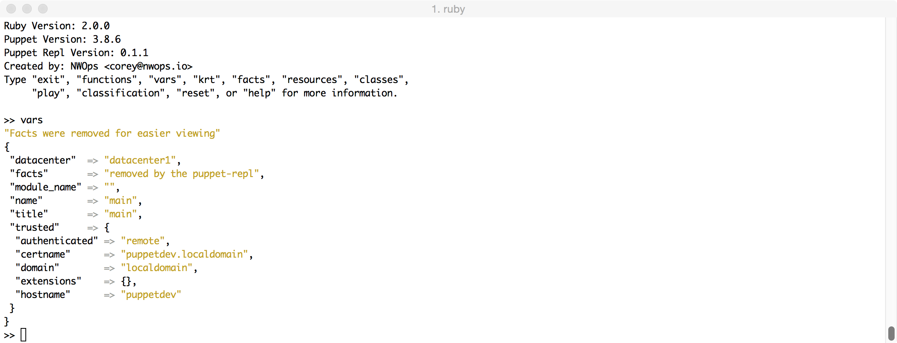
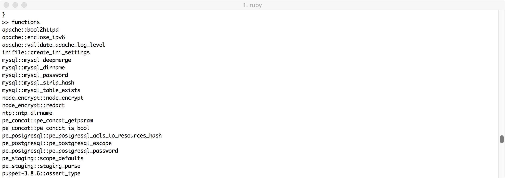
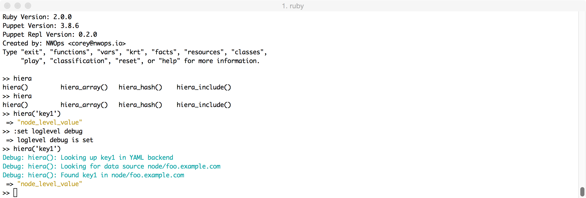

<!-- START doctoc generated TOC please keep comment here to allow auto update -->
<!-- DON'T EDIT THIS SECTION, INSTEAD RE-RUN doctoc TO UPDATE -->
**Table of Contents**  *generated with [DocToc](https://github.com/thlorenz/doctoc)*

- [puppet-repl](#puppet-repl)
  - [Compatibility](#compatibility)
  - [Production usage](#production-usage)
  - [Installation](#installation)
  - [Load path](#load-path)
  - [Interactive demo](#interactive-demo)
  - [Web demo](#web-demo)
  - [Usage](#usage)
  - [Using Variables](#using-variables)
    - [Listing variables](#listing-variables)
  - [Listing functions](#listing-functions)
  - [Using functions](#using-functions)
  - [Duplicate resource error](#duplicate-resource-error)
  - [Setting the puppet log level](#setting-the-puppet-log-level)
  - [Remote nodes](#remote-nodes)
    - [Setup](#setup)
    - [Usage](#usage-1)
      - [Command line:](#command-line)
      - [From repl session:](#from-repl-session)
  - [Auto Complete](#auto-complete)
  - [Playback support](#playback-support)
  - [Troubleshooting](#troubleshooting)
  - [Copyright](#copyright)

<!-- END doctoc generated TOC please keep comment here to allow auto update -->
[](https://travis-ci.org/nwops/puppet-repl?branch=master)[](https://badge.fury.io/rb/puppet-repl)
# puppet-repl

A interactive command line tool for evaluating the puppet language.

## Compatibility
Requires Puppet 3.8+ and only uses the future parser.

## Production usage
The puppet repl is a developer tool that should only be used when writing puppet code.  Although it might seem useful
to install on your production puppet master. Please do not install because of the puppet-repl gem dependencies that might conflict with your existing environment.

## Installation
`gem install puppet-repl`

## Load path
puppet-repl will load all functions from your basemodulepath and environmentpath.

This means if you run `puppet module install puppetlabs-stdlib` and they will be available
in the repl.  

## Interactive demo
I have put together a repo with a few setup instructions that will assist you in setting up a "mock" environment
for usage with the puppet-repl.  This was originally intended when giving a demo of the repl, but also seems
useful for other people.

https://github.com/nwops/puppet-repl-demo

## Web demo
There is a web version of the [puppet-repl](https://www.puppet-repl.com) online but is somewhat
limited at this time. In the future we will be adding lots of awesome features to the web repl.

## Usage
Puppet-repl will only parse and evaulate your code.  It will not build a catalog
and try to enforce the catalog. This has a few side affects.

1. Type and provider code will not get run.
2. Nothing is created or destroyed on your system.

`prepl`

Example Usage
```
MacBook-Pro-2/tmp % prepl
Ruby Version: 2.0.0
Puppet Version: 3.8.5
Puppet Repl Version: 0.0.7
Created by: NWOps <corey@nwops.io>
Type "exit", "functions", "vars", "krt", "facts", "reset", "help" for more information.

>> ['/tmp/test3', '/tmp/test4'].each |String $path| { file{$path: ensure => present} }
  => [
     [0] "/tmp/test3",
     [1] "/tmp/test4"
 ]
 >>

```

## Using Variables

```
MacBook-Pro-2/tmp % prepl
Ruby Version: 2.0.0
Puppet Version: 3.8.5
Puppet Repl Version: 0.0.7
Created by: NWOps <corey@nwops.io>
Type "exit", "functions", "vars", "krt", "facts", "reset", "help" for more information.

>>

>> $config_file = '/etc/httpd/httpd.conf'
 => "/etc/httpd/httpd.conf"
 >> file{$config_file: ensure => present, content => 'hello'}
  => Puppet::Type::File {
                        path => "/etc/httpd/httpd.conf",
                    provider => posix,
                      ensure => present,
                     content => "{md5}5d41402abc4b2a76b9719d911017c592",
                    checksum => nil,
                      backup => "puppet",
                     replace => true,
                       links => manage,
                       purge => false,
                sourceselect => first,
                   show_diff => true,
        validate_replacement => "%",
          source_permissions => use,
     selinux_ignore_defaults => false,
                    loglevel => notice,
                        name => "/etc/httpd/httpd.conf",
                       title => "/etc/httpd/httpd.conf"
 }
 >>
```
### Listing variables
To see the current variables in the scope use the  `vars` keyword.



## Listing functions
Knowing what functions are available and where they come from is extremely helpful especially in a repl session.  Run the `functions` keyword to get a name spaced list of functions.  You can further filter out functions by passing in a filter argument. `functions stdlib`



## Using functions
Functions will run and produce the desired output.  If you type the word `functions`
a list of available functions will be displayed on the screen along with a namespace to help you identify where they came from.

```
>> split('hello/there/one/two/three','/')
 => ["hello", "there", "one", "two", "three"]

```

So you can imagine how much fun this can be trying out different types of functions.

## Duplicate resource error
Just like normal puppet code you cannot create duplicate resources.

```
>> file{'/tmp/failure2.txt': ensure => present}
 => Evaluation Error: Error while evaluating a Resource Statement, Duplicate declaration: File[/tmp/failure2.txt] is already declared in file :1; cannot redeclare at line 1 at line 1:1

```
You can reset the parser by running `reset` within the repl without having to exit.

## Setting the puppet log level
If you want to see what puppet is doing behind the scenes you can set the log level
via `:set loglevel debug`.  Valid log levels are `debug`, `info`, `warning` and other
levels defined in puppet [config reference](https://docs.puppetlabs.com/puppet/4.4/reference/configuration.html#loglevel) .



## Remote nodes
This is new for 0.2.0.  The puppet-repl now has the ability to pull in remote node information. Instead of mocking facts you can pull in real information!  Get real facts and real node classification from the puppet master and then play with the info in the repl session. This is made possible by using the puppet node indirector interface.

ie.  `puppet node find hostname --terminus rest --render-as yaml`

In order to use this feature you will need to setup a few things.

### Setup
1. Allow node rest calls to your workstation on the puppet master(s)
See https://github.com/nwops/puppet-repl/issues/17 for more info on allowing this rule.  

2. Ensure you have the same code that your puppet master does.  Since this pulls in classification you will need to have all the puppet modules defined in your
environmentpath or basemodulepath.   The simple thing to do is to point your basemodulepath to your fixtures directory if using rspec-puppet or some other high level modules directory.   For PE users you will want to ensure you have all the
pe specific modules in your development environment.  Not doing this step will result in class not found errors.

3. Set the server config in your local puppet.conf. (on your development machine)

    a. Find your puppet config file `puppet config print config`

    b. edit the config file with an editor

    c. add `server = <hostname>` to your main block

4. If using hiera you also need to set the path to your hiera config file since
   the puppet-repl will be compiling puppet code which could in turn call hiera
   functions.  Additionally, make sure your hiera config points to the correct
   data location.

  ```
  [main]
    server = pe-puppet.localdomain
    basemodulepath = /Users/cosman/github/puppet-repl-demo/modules:/Users/cosman/Downloads/pe_modules
    hiera_config = /Users/cosman/github/puppet-repl-demo/hieradata/hiera.yaml


  ```


### Usage
There are two ways of using the remote node feature.  You can either
pass in the node name from the command line or set the node name from the repl session.

#### Command line:
`prepl -n node_name`


#### From repl session:
`:set node node_name`


This is also extremely useful to check classification rules and variables by your ENC. So instead of running your ENC script manually we get the puppet master to run this indirectly and return the results to you.

## Auto Complete
The puppet-repl uses readline internally.  So any variable or function is also available for auto completion.
Press the tab key to engage the auto complete functionality.

## Playback support
Puppet-repl now supports playing back files or urls and loading the content into the repl session.  This means if you want to start a repl session from an existing file or url you can play the content back in the repl.
You can also playback a file that contains puppet code and repl commands.

`play https://gist.githubusercontent.com/logicminds/f9b1ac65a3a440d562b0/raw`

or

`prepl -p https://gist.githubusercontent.com/logicminds/f9b1ac65a3a440d562b0/raw`


### Web based playback support
If using the [web based repl](https://www.puppet-repl.com) you can playback a shared url
which would start a repl session and then load the content from the url or parameter.

Example:
https://www.puppet-repl.com/play?url=https://gist.githubusercontent.com/logicminds/f9b1ac65a3a440d562b0.txt

or for single commands

https://www.puppet-repl.com/play?content=vars

Please note the web based repl only contains a minimal amount of puppet modules.  So its likely
that your code may not work if using third party modules.  This may change in the future though.

## Troubleshooting
Please file an issue so we can track bugs.


Pull requests welcomed.

## Copyright

Copyright (c) 2016 Corey Osman. See LICENSE.txt for
further details.
